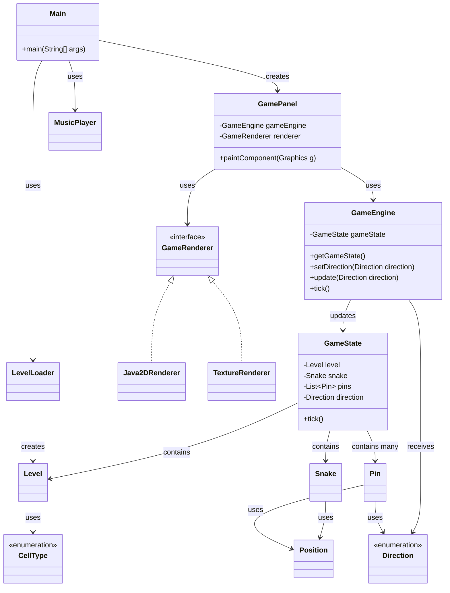

# Lösung zu Blatt 03: Methodenrefs, Lambdas, Observer

## Überblick

Dieses Dokument enthält meine schriftlichen Notizen und Erklärungen zu Blatt 03.

Die Bearbeitung besteht aus zwei Teilen:

1. Calculator: Anonyme Klassen und Lambda-Ausdrücke
2. LockSnake: Lambda-Ausdrücke, Methodenreferenzen und Observer-Pattern

## Repositories

Calculator:

`https://github.com/Exoriy/prog2-b03-calculator`

LockSnake:

`https://github.com/Exoriy/prog2-b03-locksnake`


---

## 1. Calculator: Anonyme Klassen und Lambda-Ausdrücke

### Aufgabe

Im Calculator-Projekt sollten vier TODO-Stellen in der Methode `setupOperationSelector` bearbeitet werden:

1. Eine neue Operation `Sub` als normale Java-Klasse.
2. Eine neue Operation `Mul` als anonyme Klasse.
3. Eine neue Operation `Div` als Lambda-Ausdruck.
4. Der `ActionListener` der `JComboBox` sollte von einer anonymen Klasse in einen Lambda-Ausdruck umgewandelt werden.

---

### Gradle-Konfiguration

Ich habe das Calculator Projekt als Gradle-Projekt konfiguriert.

Die Datei `settings.gradle` legt den Namen des Gradle-Projekts fest und enthält:

```groovy
rootProject.name = 'prog2-b03-calculator'
```

Die Datei `build.gradle` enthält:

```groovy
plugins {
    id 'java'
    id 'application'
}

java {
    toolchain {
        languageVersion = JavaLanguageVersion.of(25)
    }
}

application {
    mainClass = 'calculator.Main'
}

spotless {
    java {
        googleJavaFormat()
        target 'src/**/*.java'
    }
}
```

Danach habe ich den Gradle Wrapper im Projektordner erzeugt:

```bash
gradle wrapper
```

Das Projekt kann mit Gradle gestartet werden:

```bash
.\gradlew run
```

---

### Klasse `Sub`

Für die Subtraktion habe ich eine eigene Klasse `Sub` erstellt.

```java
package calculator;

/** Simple subtraction. */
public class Sub implements Operation {

  @Override
  public int doOperation(int a, int b) {
    return a - b;
  }
}
```

Diese Klasse implementiert das Interface `Operation`.

In `Calculator.java` wird sie so eingebunden:

```java
operations.put("Sub", new Sub());
```

Hier verwende ich bewusst keine anonyme Klasse und keinen Lambda-Ausdruck, weil die Aufgabe eine normale Java-Klasse verlangt.

---

### Operation `Mul` als anonyme Klasse

Die Multiplikation habe ich als anonyme Klasse umgesetzt:

```java
operations.put(
    "Mul",
    new Operation() {
      @Override
      public int doOperation(int a, int b) {
        return a * b;
      }
    });
```

Eine anonyme Klasse ist hier möglich, weil direkt beim Erzeugen des Objekts die Methode `doOperation` implementiert wird.

---

### Operation `Div` als Lambda-Ausdruck

Die Integerdivision habe ich als Lambda-Ausdruck umgesetzt:

```java
operations.put("Div", (a, b) -> a / b);
```

Das funktioniert, weil Operation ein funktionales Interface ist. Es besitzt nur eine abstrakte Methode:

```java
int doOperation(int a, int b);
```

Deshalb kann Java den Lambda-Ausdruck automatisch als Implementierung von Operation interpretieren.

---

### `ActionListener` als Lambda-Ausdruck

Der ursprüngliche `ActionListener` war als anonyme Klasse geschrieben. Ich habe ihn durch einen Lambda-Ausdruck ersetzt:

```java
operationSelector.addActionListener(
    e -> {
      try {
        result.setText("" + calculate());
      } catch (NumberFormatException ex) {
        System.out.println("Invalid input.");
      }
    });
```

Auch das funktioniert, weil `ActionListener` nur eine zentrale Methode besitzt, nämlich `actionPerformed`.

---

### Lokale Prüfung

Ich habe das Projekt formatiert und geprüft:

```bash
.\gradlew spotlessApply
.\gradlew spotlessCheck
```

Danach habe ich das Projekt gebaut:

```bash
.\gradlew build
```

Außerdem habe ich die Anwendung gestartet:

```bash
.\gradlew run
```

Im Calculator habe ich die Operationen `Add`, `Sub`, `Mul` und `Div` manuell getestet.


---

## 2. LockSnake: Code-Analyse und UML

### Aufgabe

In diesem Teil analysiere ich die vorgegebene Struktur des LockSnake-Projekts. Ziel ist es, die wichtigsten Klassen, Packages und Beziehungen im Projekt zu verstehen und als UML-Klassendiagramm darzustellen.

Das Projekt verwendet das Package `de.hsbi.lockgame`.

Die wichtigsten Klassen liegen in folgenden Packages:

| Package | Klassen |
|---|---|
| `de.hsbi.lockgame` | `Main` |
| `de.hsbi.lockgame.io` | `LevelLoader`, `MusicPlayer` |
| `de.hsbi.lockgame.logic` | `GameEngine`, `GameState` |
| `de.hsbi.lockgame.model` | `CellType`, `Direction`, `Level`, `Pin`, `Position`, `Snake` |
| `de.hsbi.lockgame.settings` | `AudioConstants`, `GameConstants`, `InputConstants`, `LevelConstants`, `TextureConstants` |
| `de.hsbi.lockgame.ui` | `GamePanel` |
| `de.hsbi.lockgame.ui.render` | `GameRenderer`, `Java2DRenderer`, `TextureRenderer` |

---

### Analyse der Projektstruktur

Die Projektstruktur sieht vereinfacht so aus:

```text
src/main/java/de/hsbi/lockgame
├── Main.java
├── io
│   ├── LevelLoader.java
│   └── MusicPlayer.java
├── logic
│   ├── GameEngine.java
│   └── GameState.java
├── model
│   ├── CellType.java
│   ├── Direction.java
│   ├── Level.java
│   ├── Pin.java
│   ├── Position.java
│   └── Snake.java
├── settings
│   ├── AudioConstants.java
│   ├── GameConstants.java
│   ├── InputConstants.java
│   ├── LevelConstants.java
│   └── TextureConstants.java
└── ui
    ├── GamePanel.java
    └── render
        ├── GameRenderer.java
        ├── Java2DRenderer.java
        └── TextureRenderer.java
```

Zusätzlich gibt es Ressourcen unter:

```text
src/main/resources
├── audio
├── levels
│   ├── level1.txt
│   └── level2.txt
└── textures
```

Die Level-Dateien befinden sich also nicht direkt im Java-Code, sondern werden als Ressourcen geladen.

---

### Wichtige Klassen

| Klasse / Typ | Aufgabe |
|---|---|
| `Main` | startet die Anwendung und erzeugt das Spielfenster |
| `GamePanel` | Swing-Komponente für Darstellung, Timer und Tastatureingaben |
| `GameEngine` | verwaltet die Spiellogik und aktualisiert den Spielzustand |
| `GameState` | modelliert den aktuellen Zustand des Spiels |
| `GameRenderer` | Interface für Renderer |
| `Java2DRenderer` | rendert das Spiel mit Java2D |
| `TextureRenderer` | rendert das Spiel mit Texturen |
| `Level` | beschreibt das Spielfeld |
| `LevelLoader` | lädt Level-Dateien aus den Ressourcen |
| `MusicPlayer` | spielt Musik oder Sounds ab |
| `CellType` | beschreibt Zelltypen des Spielfelds |
| `Position` | beschreibt Koordinaten auf dem Spielfeld |
| `Direction` | beschreibt Bewegungsrichtungen |
| `Pin` | beschreibt einen Pin im Spiel |
| `Snake` | beschreibt die Schlange |

---

### Analyse der TODO-Stellen

Um die noch offenen Stellen im Projekt zu finden, habe ich folgenden Befehl verwendet:

```bash
Get-ChildItem -Path src\main\java -Recurse -Filter *.java | Select-String "TODO"
```

Dabei wurden TODO-Stellen vor allem in diesen Dateien gefunden:

```text
src/main/java/de/hsbi/lockgame/logic/GameEngine.java
src/main/java/de/hsbi/lockgame/logic/GameState.java
```

Das bedeutet, dass vor allem die Spiellogik und der Spielzustand ergänzt werden müssen.

`GameEngine` soll den `GameState` verwalten, auf Tastatureingaben reagieren und Observer benachrichtigen.

`GameState` soll den konkreten Spielzustand speichern und bei jedem Tick aktualisieren.

---

### UML-Klassendiagramm



---

### Erklärung der Beziehungen

`Main` ist der Einstiegspunkt der Anwendung. Dort wird das Spiel gestartet und das Fenster erzeugt.

`GamePanel` ist für die grafische Darstellung und die Eingaben zuständig. Es verwendet einen Renderer, um den aktuellen Spielzustand zu zeichnen.

`GameRenderer` ist ein Interface. Die Klassen `Java2DRenderer` und `TextureRenderer` implementieren dieses Interface und bieten unterschiedliche Möglichkeiten zur Darstellung.

`GameEngine` enthält die zentrale Spiellogik. Sie verwaltet einen `GameState`, reagiert auf Richtungsänderungen und führt pro Tick eine Aktualisierung aus.

`GameState` enthält den eigentlichen Zustand des Spiels. Dazu gehören das Level, die Snake, die Pins und die aktuelle Richtung.

`LevelLoader` lädt Level-Dateien aus den Ressourcen und erzeugt daraus ein `Level`.

`Snake`, `Pin`, `Position`, `Direction` und `CellType` sind Modellklassen beziehungsweise Datentypen, die für die Beschreibung des Spielzustands benötigt werden.

---

### Ergebnis der Analyse

Die Analyse zeigt, dass das Projekt bereits klar in unterschiedliche Verantwortungsbereiche aufgeteilt ist:

| Bereich | Aufgabe |
|---|---|
| `io` | Laden von Leveln und Audio |
| `logic` | Spiellogik und Spielzustand |
| `model` | Datenmodell des Spiels |
| `settings` | Konstanten |
| `ui` | Darstellung und Benutzereingaben |

Für die weitere Bearbeitung sind besonders die Klassen `GameEngine` und `GameState` wichtig, weil dort die meisten TODO-Stellen liegen und dort die Spiellogik ergänzt werden muss.


