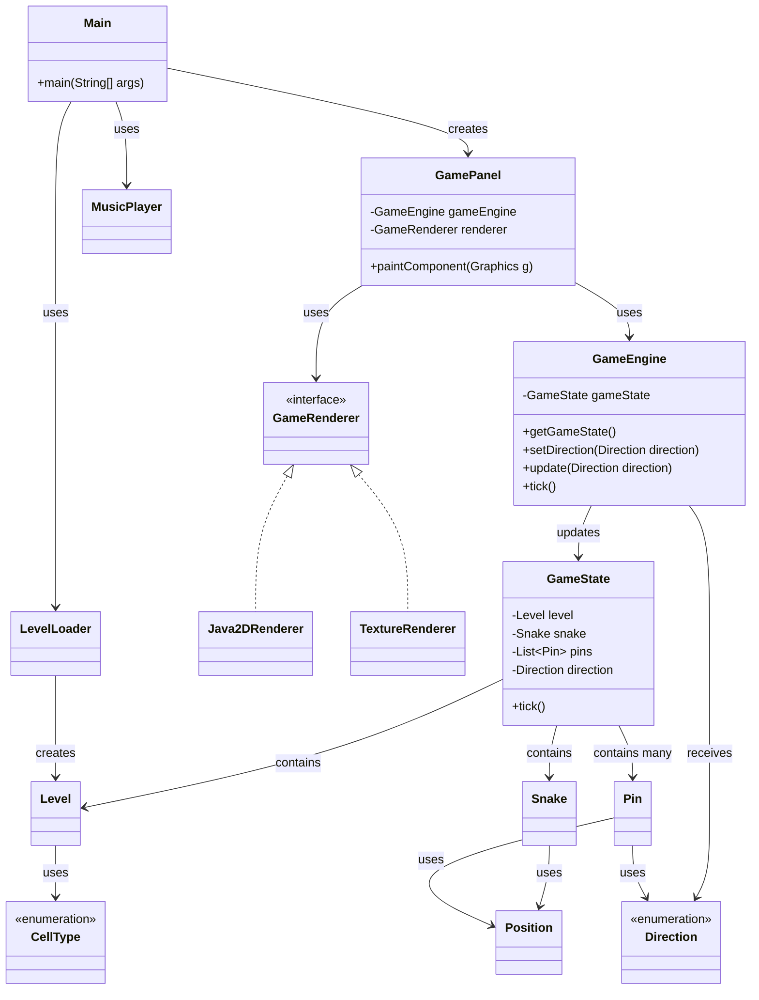

# Lösung zu Blatt 03: Methodenrefs, Lambdas, Observer

## Überblick

Dieses Dokument enthält meine schriftlichen Notizen und Erklärungen zu Blatt 03.

Die Bearbeitung besteht aus zwei Teilen:

1. Calculator: Anonyme Klassen und Lambda-Ausdrücke
2. LockSnake: Lambda-Ausdrücke, Methodenreferenzen und Observer-Pattern

## Repositories

Calculator:

`https://github.com/Exoriy/prog2-b03-calculator`

LockSnake:

`https://github.com/Exoriy/prog2-b03-locksnake`


---

## 1. Calculator: Anonyme Klassen und Lambda-Ausdrücke

### Aufgabe

Im Calculator-Projekt sollten vier TODO-Stellen in der Methode `setupOperationSelector` bearbeitet werden:

1. Eine neue Operation `Sub` als normale Java-Klasse.
2. Eine neue Operation `Mul` als anonyme Klasse.
3. Eine neue Operation `Div` als Lambda-Ausdruck.
4. Der `ActionListener` der `JComboBox` sollte von einer anonymen Klasse in einen Lambda-Ausdruck umgewandelt werden.

---

### Gradle-Konfiguration

Ich habe das Calculator Projekt als Gradle-Projekt konfiguriert.

Die Datei `settings.gradle` legt den Namen des Gradle-Projekts fest und enthält:

```groovy
rootProject.name = 'prog2-b03-calculator'
```

Die Datei `build.gradle` enthält:

```groovy
plugins {
    id 'java'
    id 'application'
}

java {
    toolchain {
        languageVersion = JavaLanguageVersion.of(25)
    }
}

application {
    mainClass = 'calculator.Main'
}

spotless {
    java {
        googleJavaFormat()
        target 'src/**/*.java'
    }
}
```

Danach habe ich den Gradle Wrapper im Projektordner erzeugt:

```bash
gradle wrapper
```

Das Projekt kann mit Gradle gestartet werden:

```bash
.\gradlew run
```

---

### Klasse `Sub`

Für die Subtraktion habe ich eine eigene Klasse `Sub` erstellt.

```java
package calculator;

/** Simple subtraction. */
public class Sub implements Operation {

  @Override
  public int doOperation(int a, int b) {
    return a - b;
  }
}
```

Diese Klasse implementiert das Interface `Operation`.

In `Calculator.java` wird sie so eingebunden:

```java
operations.put("Sub", new Sub());
```

Hier verwende ich bewusst keine anonyme Klasse und keinen Lambda-Ausdruck, weil die Aufgabe eine normale Java-Klasse verlangt.

---

### Operation `Mul` als anonyme Klasse

Die Multiplikation habe ich als anonyme Klasse umgesetzt:

```java
operations.put(
    "Mul",
    new Operation() {
      @Override
      public int doOperation(int a, int b) {
        return a * b;
      }
    });
```

Eine anonyme Klasse ist hier möglich, weil direkt beim Erzeugen des Objekts die Methode `doOperation` implementiert wird.

---

### Operation `Div` als Lambda-Ausdruck

Die Integerdivision habe ich als Lambda-Ausdruck umgesetzt:

```java
operations.put("Div", (a, b) -> a / b);
```

Das funktioniert, weil Operation ein funktionales Interface ist. Es besitzt nur eine abstrakte Methode:

```java
int doOperation(int a, int b);
```

Deshalb kann Java den Lambda-Ausdruck automatisch als Implementierung von Operation interpretieren.

---

### `ActionListener` als Lambda-Ausdruck

Der ursprüngliche `ActionListener` war als anonyme Klasse geschrieben. Ich habe ihn durch einen Lambda-Ausdruck ersetzt:

```java
operationSelector.addActionListener(
    e -> {
      try {
        result.setText("" + calculate());
      } catch (NumberFormatException ex) {
        System.out.println("Invalid input.");
      }
    });
```

Auch das funktioniert, weil `ActionListener` nur eine zentrale Methode besitzt, nämlich `actionPerformed`.

---

### Lokale Prüfung

Ich habe das Projekt formatiert und geprüft:

```bash
.\gradlew spotlessApply
.\gradlew spotlessCheck
```

Danach habe ich das Projekt gebaut:

```bash
.\gradlew build
```

Außerdem habe ich die Anwendung gestartet:

```bash
.\gradlew run
```

Im Calculator habe ich die Operationen `Add`, `Sub`, `Mul` und `Div` manuell getestet.


---

## 2. LockSnake: Code-Analyse und UML

### Aufgabe

In diesem Teil analysiere ich die vorgegebene Struktur des LockSnake-Projekts. Ziel ist es, die wichtigsten Klassen, Packages und Beziehungen im Projekt zu verstehen und als UML-Klassendiagramm darzustellen.

Das Projekt verwendet das Package `de.hsbi.lockgame`.

Die wichtigsten Klassen liegen in folgenden Packages:

| Package | Klassen |
|---|---|
| `de.hsbi.lockgame` | `Main` |
| `de.hsbi.lockgame.io` | `LevelLoader`, `MusicPlayer` |
| `de.hsbi.lockgame.logic` | `GameEngine`, `GameState` |
| `de.hsbi.lockgame.model` | `CellType`, `Direction`, `Level`, `Pin`, `Position`, `Snake` |
| `de.hsbi.lockgame.settings` | `AudioConstants`, `GameConstants`, `InputConstants`, `LevelConstants`, `TextureConstants` |
| `de.hsbi.lockgame.ui` | `GamePanel` |
| `de.hsbi.lockgame.ui.render` | `GameRenderer`, `Java2DRenderer`, `TextureRenderer` |

---

### Analyse der Projektstruktur

Die Projektstruktur sieht vereinfacht so aus:

```text
src/main/java/de/hsbi/lockgame
├── Main.java
├── io
│   ├── LevelLoader.java
│   └── MusicPlayer.java
├── logic
│   ├── GameEngine.java
│   └── GameState.java
├── model
│   ├── CellType.java
│   ├── Direction.java
│   ├── Level.java
│   ├── Pin.java
│   ├── Position.java
│   └── Snake.java
├── settings
│   ├── AudioConstants.java
│   ├── GameConstants.java
│   ├── InputConstants.java
│   ├── LevelConstants.java
│   └── TextureConstants.java
└── ui
    ├── GamePanel.java
    └── render
        ├── GameRenderer.java
        ├── Java2DRenderer.java
        └── TextureRenderer.java
```

Zusätzlich gibt es Ressourcen unter:

```text
src/main/resources
├── audio
├── levels
│   ├── level1.txt
│   └── level2.txt
└── textures
```

Die Level-Dateien befinden sich also nicht direkt im Java-Code, sondern werden als Ressourcen geladen.

---

### Wichtige Klassen

| Klasse / Typ | Aufgabe |
|---|---|
| `Main` | startet die Anwendung und erzeugt das Spielfenster |
| `GamePanel` | Swing-Komponente für Darstellung, Timer und Tastatureingaben |
| `GameEngine` | verwaltet die Spiellogik und aktualisiert den Spielzustand |
| `GameState` | modelliert den aktuellen Zustand des Spiels |
| `GameRenderer` | Interface für Renderer |
| `Java2DRenderer` | rendert das Spiel mit Java2D |
| `TextureRenderer` | rendert das Spiel mit Texturen |
| `Level` | beschreibt das Spielfeld |
| `LevelLoader` | lädt Level-Dateien aus den Ressourcen |
| `MusicPlayer` | spielt Musik oder Sounds ab |
| `CellType` | beschreibt Zelltypen des Spielfelds |
| `Position` | beschreibt Koordinaten auf dem Spielfeld |
| `Direction` | beschreibt Bewegungsrichtungen |
| `Pin` | beschreibt einen Pin im Spiel |
| `Snake` | beschreibt die Schlange |

---

### Analyse der TODO-Stellen

Um die noch offenen Stellen im Projekt zu finden, habe ich folgenden Befehl verwendet:

```bash
Get-ChildItem -Path src\main\java -Recurse -Filter *.java | Select-String "TODO"
```

Dabei wurden TODO-Stellen vor allem in diesen Dateien gefunden:

```text
src/main/java/de/hsbi/lockgame/logic/GameEngine.java
src/main/java/de/hsbi/lockgame/logic/GameState.java
```

Das bedeutet, dass vor allem die Spiellogik und der Spielzustand ergänzt werden müssen.

`GameEngine` soll den `GameState` verwalten, auf Tastatureingaben reagieren und Observer benachrichtigen.

`GameState` soll den konkreten Spielzustand speichern und bei jedem Tick aktualisieren.

---

### UML-Klassendiagramm



---

### Erklärung der Beziehungen

`Main` ist der Einstiegspunkt der Anwendung. Dort wird das Spiel gestartet und das Fenster erzeugt.

`GamePanel` ist für die grafische Darstellung und die Eingaben zuständig. Es verwendet einen Renderer, um den aktuellen Spielzustand zu zeichnen.

`GameRenderer` ist ein Interface. Die Klassen `Java2DRenderer` und `TextureRenderer` implementieren dieses Interface und bieten unterschiedliche Möglichkeiten zur Darstellung.

`GameEngine` enthält die zentrale Spiellogik. Sie verwaltet einen `GameState`, reagiert auf Richtungsänderungen und führt pro Tick eine Aktualisierung aus.

`GameState` enthält den eigentlichen Zustand des Spiels. Dazu gehören das Level, die Snake, die Pins und die aktuelle Richtung.

`LevelLoader` lädt Level-Dateien aus den Ressourcen und erzeugt daraus ein `Level`.

`Snake`, `Pin`, `Position`, `Direction` und `CellType` sind Modellklassen beziehungsweise Datentypen, die für die Beschreibung des Spielzustands benötigt werden.

---

### Ergebnis der Analyse

Die Analyse zeigt, dass das Projekt bereits klar in unterschiedliche Verantwortungsbereiche aufgeteilt ist:

| Bereich | Aufgabe |
|---|---|
| `io` | Laden von Leveln und Audio |
| `logic` | Spiellogik und Spielzustand |
| `model` | Datenmodell des Spiels |
| `settings` | Konstanten |
| `ui` | Darstellung und Benutzereingaben |

Für die weitere Bearbeitung sind besonders die Klassen `GameEngine` und `GameState` wichtig, weil dort die meisten TODO-Stellen liegen und dort die Spiellogik ergänzt werden muss.


---

## 3. LockSnake: Implementierung von `GameState` und `GameEngine`

### Aufgabe

In diesem Teil habe ich die fehlende Spiellogik in den Klassen `GameState` und `GameEngine` ergänzt.

`GameState` modelliert den aktuellen Zustand des Spiels. Dazu gehören:

- das Level
- die Snake
- die Pins
- der Spielstatus
- die aktuell gesetzte Bewegungsrichtung

`GameEngine` verwaltet den aktuellen `GameState`, reagiert auf Richtungsänderungen und führt pro Tick eine Aktualisierung des Spiels aus.

---

### Änderung an `Position`

Für Vergleiche von Positionen habe ich `equals`, `hashCode` und `toString` in `Position` ergänzt.

Das ist wichtig, weil Positionen im Spiel anhand ihrer Koordinaten verglichen werden müssen. Ohne `equals` wären zwei Positionen mit denselben Koordinaten nicht automatisch gleich.

Beispiel:

```java
@Override
public boolean equals(Object other) {
  if (this == other) {
    return true;
  }

  if (!(other instanceof Position position)) {
    return false;
  }

  return x == position.x && y == position.y;
}
```

---

### Implementierung von `GameState`

Der Konstruktor speichert die übergebenen Werte:

```java
public GameState(
    Level level, Snake snake, List<Pin> pins, Status status, Direction pendingDirection) {
  this.level = Objects.requireNonNull(level);
  this.snake = Objects.requireNonNull(snake);
  this.pins = List.copyOf(Objects.requireNonNull(pins));
  this.status = Objects.requireNonNull(status);
  this.pendingDirection = Objects.requireNonNull(pendingDirection);
}
```

Die Getter geben den aktuellen Zustand zurück:

```java
public Level level() {
  return level;
}

public Snake snake() {
  return snake;
}

public List<Pin> pins() {
  return pins;
}

public Status status() {
  return status;
}

public Direction pendingDirection() {
  return pendingDirection;
}
```

---

### Spiellogik in `tick`

Die Methode `tick()` berechnet den nächsten Spielzustand.

Zuerst gibt es einen early exit:

```java
if (!status.isRunning() || pendingDirection == Direction.NONE) {
  return this;
}
```

Das bedeutet: Wenn das Spiel nicht läuft oder keine Richtung gesetzt ist, ändert sich nichts.

Danach wird die nächste Kopfposition berechnet:

```java
Position nextHead = snake.nextHead(pendingDirection);
```

Folgende Fälle werden geprüft:

| Fall | Ergebnis |
|---|---|
| Schlange verlässt das Spielfeld | Spielstatus `LOST_OUT_OF_BOUNDS` |
| Schlange läuft gegen eine Wand | keine Bewegung, Richtung wird `NONE` |
| Schlange beißt sich selbst | Spielstatus `LOST_SELF_COLLISION` |
| Schlange läuft falsch auf einen Pin | keine Bewegung, Richtung wird `NONE` |
| Schlange aktiviert einen Pin korrekt | Pin wird gesetzt |
| Alle Pins sind gesetzt | Spielstatus `WON` |
| Normales Feld | Schlange bewegt sich beziehungsweise wächst |

---

### Pin-Logik

Wenn die Schlange auf einen Pin schauen würde, prüfe ich, ob der Pin noch nicht gesetzt ist und ob die Bewegungsrichtung zur Aktivierungsrichtung passt.

```java
if (pin.state().isSet() || pin.activationDirection() != pendingDirection) {
  return withDirection(Direction.NONE);
}
```

Wenn der Pin korrekt aktiviert wird, wird er auf `HIGH` gesetzt:

```java
List<Pin> newPins =
    pins.stream()
        .map(currentPin -> currentPin.equals(pin) ? currentPin.withState(Pin.State.HIGH) : currentPin)
        .toList();
```

Danach wird geprüft, ob alle Pins gesetzt sind:

```java
private boolean allPinsSet(List<Pin> pins) {
  return pins.stream().map(Pin::state).allMatch(Pin.State::isSet);
}
```

Hier verwende ich auch Method References:

```java
Pin::state
Pin.State::isSet
```

---

### Implementierung von `GameEngine`

`GameEngine` erzeugt beim Start einen initialen `GameState`.

```java
public GameEngine(Level level) {
  Objects.requireNonNull(level);

  this.state =
      new GameState(
          level,
          new Snake(List.of(level.snakeStart())),
          level.pins(),
          GameState.Status.RUNNING,
          Direction.NONE);
}
```

Die Methode `update(Direction direction)` reagiert auf Tastatureingaben:

```java
public void update(Direction direction) {
  if (direction == null || !state.status().isRunning()) {
    return;
  }

  state =
      new GameState(
          state.level(), state.snake(), state.pins(), state.status(), direction);

  notifyPanel();
}
```

Die Methode `tick()` lässt den aktuellen `GameState` einen Schritt weiterlaufen:

```java
public void tick() {
  state = state.tick();
  notifyPanel();
}
```

Danach wird das `GamePanel` benachrichtigt:

```java
private void notifyPanel() {
  if (panel != null) {
    panel.update(state);
  }
}
```

Damit ist `GamePanel` der Observer für den `GameState`.

---

### Lambda-Ausdrücke und Method References

In der Implementierung werden Lambda-Ausdrücke und Method References verwendet.

Lambda-Ausdruck:

```java
pin -> pin.position().equals(position)
```

Lambda-Ausdruck:

```java
currentPin -> currentPin.equals(pin) ? currentPin.withState(Pin.State.HIGH) : currentPin
```

Method References:

```java
Pin::state
Pin.State::isSet
```

---

### Lokale Prüfung

Ich habe die Formatierung angewendet:

```bash
.\gradlew spotlessApply
```

Danach habe ich geprüft:

```bash
.\gradlew spotlessCheck
```

Anschließend habe ich das Projekt gebaut:

```bash
.\gradlew build
```

Zum Schluss habe ich das Spiel gestartet und erfolgreich abgeschlossen:

```bash
.\gradlew run
```


---

## 4. LockSnake: Observer-Pattern

### Aufgabe

In LockSnake soll das Observer-Pattern verwendet werden.

Dabei gibt es zwei wichtige Beobachtungsrichtungen:

1. `GameEngine` beobachtet Richtungsänderungen aus dem `GamePanel`.
2. `GamePanel` beobachtet Änderungen am `GameState`, damit die Oberfläche neu gezeichnet wird.

---

### Richtungseingaben: `GamePanel` -> `GameEngine`

Das `GamePanel` verarbeitet Tastatureingaben. In `setupKeyBindings` wird eine Taste einer `Direction` zugeordnet.

Wenn eine Taste gedrückt wird, ruft das `GamePanel` die Methode `update(Direction direction)` der `GameEngine` auf.

Vereinfacht sieht das so aus:

```java
gameEngine.update(direction);
```

Damit ist die `GameEngine` ein Observer für Richtungsänderungen. Das `GamePanel` liefert das Ereignis, und die `GameEngine` reagiert darauf.

Die Methode in `GameEngine` sieht vereinfacht so aus:

```java
public void update(Direction direction) {
  if (direction == null || !state.status().isRunning()) {
    return;
  }

  state =
      new GameState(
          state.level(), state.snake(), state.pins(), state.status(), direction);

  notifyPanel();
}
```

Die Richtung wird also nicht direkt im `GamePanel` verarbeitet, sondern an die Spiellogik weitergegeben.

---

### Spielzustand: `GameEngine` -> `GamePanel`

Die `GameEngine` verändert den Spielzustand. Danach muss die Oberfläche neu gezeichnet werden.

Dafür wird das `GamePanel` über den neuen `GameState` informiert:

```java
private void notifyPanel() {
  if (panel != null) {
    panel.update(state);
  }
}
```

Im `GamePanel` wird der neue Zustand gespeichert und anschließend neu gezeichnet:

```java
public void update(GameState newState) {
  this.state = newState;
  repaint();
}
```

Damit ist das `GamePanel` ein Observer für Änderungen am `GameState`.

---

### Verbindung in `Main`

In `Main` werden `GameEngine` und `GamePanel` miteinander verbunden.

```java
engine.setGamePanel(panel);
panel.setGameEngine(engine);
```

Dadurch entstehen zwei Kommunikationsrichtungen:

| Richtung | Bedeutung |
|---|---|
| `GamePanel` -> `GameEngine` | Tastatureingaben werden als `Direction` an die Spiellogik weitergegeben |
| `GameEngine` -> `GamePanel` | Änderungen am `GameState` werden an die Oberfläche gemeldet |

---

### Tick-Mechanismus

Der Timer in `Main` ruft regelmäßig `engine.tick()` auf.

```java
engine.tick();
```

In `GameEngine` wird dadurch der nächste Zustand berechnet:

```java
public void tick() {
  state = state.tick();
  notifyPanel();
}
```

Nach jedem Tick wird also das `GamePanel` informiert, damit die Anzeige aktualisiert wird.

---

### Ein Observer-Pattern

Das Observer-Pattern trennt die Quelle eines Ereignisses von der Reaktion auf dieses Ereignis.

Im Projekt gibt es zwei Beispiele:

| Observable / Quelle | Observer / Empfänger | Ereignis |
|---|---|---|
| `GamePanel` | `GameEngine` | neue Richtung durch Tastendruck |
| `GameEngine` | `GamePanel` | neuer Spielzustand |

Der Vorteil ist, dass Eingabe, Spiellogik und Darstellung getrennt bleiben:

- `GamePanel` muss die Spiellogik nicht selbst berechnen.
- `GameEngine` muss nicht selbst zeichnen.
- `GameState` enthält nur Zustandsdaten und Spiellogik.
- Die Oberfläche wird nur informiert, wenn sich etwas geändert hat.

---

### Lokale Prüfung

Ich habe das Projekt lokal geprüft:

```bash
.\gradlew spotlessCheck
.\gradlew build
```

Außerdem habe ich nach offenen TODO-Stellen gesucht:

```bash
Get-ChildItem -Path src\main\java -Recurse -Filter *.java | Select-String "TODO"
```


---

## 5. LockSnake: JUnit

### Aufgabe

Für die Klasse `GameState` sollen mindestens 10 JUnit-Testfälle geschrieben werden.

Ich habe die Tests in folgender Datei erstellt:

```text
src/test/java/de/hsbi/lockgame/logic/GameStateTest.java
```

Die Tests sind nach dem Muster `given - when - then` aufgebaut.

---

### Getestete Bereiche

Die Tests prüfen verschiedene Bereiche der Spiellogik:

| Testfall | Bedeutung |
|---|---|
| `constructorStoresInitialValues` | Der Konstruktor speichert die übergebenen Werte korrekt. |
| `tickReturnsSameStateWhenDirectionIsNone` | Ohne Richtung ändert sich der Zustand nicht. |
| `tickReturnsSameStateWhenGameIsNotRunning` | Wenn das Spiel nicht läuft, ändert `tick()` nichts. |
| `tickMovesSnakeToEmptyCell` | Die Snake bewegt sich auf ein freies Feld. |
| `tickSetsLostStatusWhenSnakeLeavesLevel` | Das Spiel endet, wenn die Snake das Level verlässt. |
| `tickStopsSnakeWhenNextCellIsWall` | Eine Wand blockiert die Bewegung. |
| `tickSetsLostStatusWhenSnakeHitsItself` | Das Spiel endet bei Selbstkollision. |
| `tickActivatesPinWhenDirectionMatches` | Ein Pin wird bei passender Richtung aktiviert. |
| `tickDoesNotActivatePinWhenDirectionDoesNotMatch` | Ein Pin wird bei falscher Richtung nicht aktiviert. |
| `tickKeepsGameRunningWhenNotAllPinsAreSet` | Das Spiel läuft weiter, solange noch Pins offen sind. |
| `tickSetsWonWhenLastPinIsActivated` | Das Spiel wird gewonnen, wenn alle Pins gesetzt sind. |
| `pinsListReturnedByGameStateIsImmutable` | Die Pin-Liste im GameState ist nicht von außen veränderbar. |

---

### Die Tests relevant

Die Tests sind relevant, weil sie die zentralen Regeln des Spiels überprüfen.

`GameState.tick()` ist die wichtigste Methode für die Spiellogik. Deshalb teste ich dort normale Bewegungen, blockierte Bewegungen, Verlustbedingungen und Gewinnbedingungen.

Besonders wichtig sind Randfälle:

- keine Richtung gesetzt
- Spiel ist bereits beendet
- Bewegung aus dem Level heraus
- Bewegung gegen eine Wand
- Selbstkollision
- Aktivierung eines Pins mit richtiger oder falscher Richtung

Dadurch wird geprüft, dass der Spielzustand nicht nur im normalen Fall funktioniert, sondern auch bei wichtigen Sonderfällen korrekt reagiert.

---

### Die Testfälle unterschiede

Die Tests prüfen unterschiedliche Verhaltensweisen:

- Initialisierung
- normale Bewegung
- Stillstand
- Verlust
- Gewinn
- Pin-Logik
- Wandkollision
- Selbstkollision
- Immutability

Dadurch testen die Fälle nicht nur dieselbe Methode mit anderen Zahlen, sondern verschiedene Regeln des Spiels.

---

### Ausführung

Die Tests werden mit Gradle gestartet:

```bash
.\gradlew test
```

Die Formatierung wird geprüft mit:

```bash
.\gradlew spotlessCheck
```

Der gesamte Build wird geprüft mit:

```bash
.\gradlew build
```

Alle Prüfungen waren erfolgreich.


---

## 6. Checkliste

### Calculator

Das Calculator-Projekt wurde bearbeitet.

Erledigte Punkte:

- `Sub` wurde als eigene Java-Klasse implementiert.
- `Mul` wurde als anonyme Klasse implementiert.
- `Div` wurde als Lambda-Ausdruck implementiert.
- Der `ActionListener` wurde durch einen Lambda-Ausdruck ersetzt.
- Das Projekt wurde mit Gradle konfiguriert.
- Die Anwendung kann mit Gradle gestartet werden.

Prüfung:

```bash
.\gradlew spotlessCheck
.\gradlew build
.\gradlew run
```

---

### LockSnake

Das LockSnake-Projekt wurde analysiert und erweitert.

Erledigte Punkte:

- UML-Klassendiagramm erstellt.
- `GameState` implementiert.
- `GameEngine` implementiert.
- Observer-Pattern erklärt.
- Mindestens 10 JUnit-Tests für `GameState` erstellt.
- Lambda-Ausdrücke verwendet.
- Method References verwendet.
- Gradle-Konfiguration ergänzt.
- Spotless-Konfiguration ergänzt.

Prüfung:

```bash
.\gradlew spotlessCheck
.\gradlew test
.\gradlew build
```

---

### Lambda-Ausdrücke

Im LockSnake-Projekt werden folgende Lambda-Ausdrücke verwendet:

```java
pin -> pin.position().equals(position)
```

```java
currentPin -> currentPin.equals(pin) ? currentPin.withState(Pin.State.HIGH) : currentPin
```

Zusätzlich werden Lambda-Ausdrücke in den Tests verwendet, zum Beispiel bei `assertThrows`.

---

### Method References

Im LockSnake-Projekt werden folgende Method References verwendet:

```java
Pin::state
```

```java
Pin.State::isSet
```

Diese werden verwendet, um zu prüfen, ob alle Pins gesetzt sind.

---

### JUnit-Tests

Die JUnit-Tests für `GameState` befinden sich hier:

```text
src/test/java/de/hsbi/lockgame/logic/GameStateTest.java
```

Es wurden 10 Testfälle erstellt:

- Konstruktor
- Bewegung ohne Richtung
- Bewegung auf freies Feld
- Kollision mit Wand
- Verlassen des Levels
- Selbstkollision
- Pin-Aktivierung
- falsche Pin-Richtung
- Gewinnbedingung
- unveränderliche Pin-Liste

---

### Abgabe-Repositories

Textaufgaben:

```text
https://github.com/Exoriy/prog2-b03-solutions
```

Calculator-Projekt:

```text
https://github.com/Exoriy/prog2-b03-calculator
```

LockSnake-Projekt:

```text
https://github.com/Exoriy/prog2-b03-locksnake
```

---

### Hinweise zur Abgabe

Die Java-Projekte enthalten die vollständigen Build-Skripte und Git-Konfiguration.

Nicht abgegeben werden generierte Ordner wie:

```text
.gradle/
.idea/
build/
.build/
out/
```

---

## Kurze Zusammenfassung

In Blatt 03 habe ich den Calculator mit einer normalen Klasse, einer anonymen Klasse und Lambda-Ausdrücken erweitert. Außerdem habe ich LockSnake analysiert, `GameState` und `GameEngine` implementiert, das Observer-Pattern erklärt und die Spiellogik mit JUnit-Tests überprüft.
